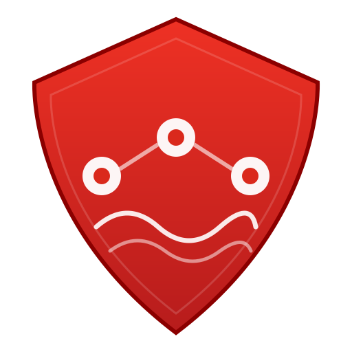
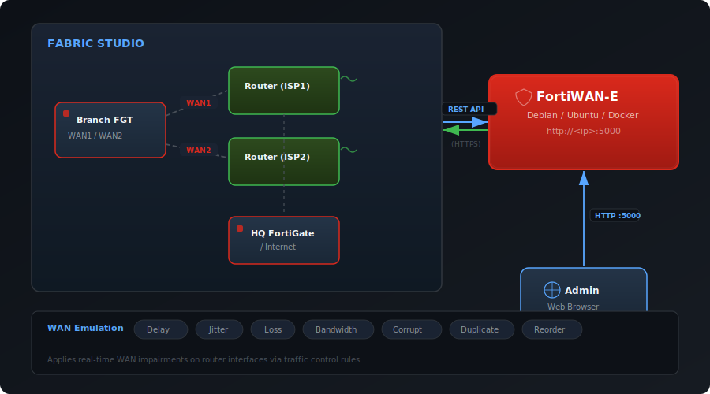

<p align="center">
  
</p>

<h1 align="center">FortiWAN-E</h1>

<p align="center">
  <strong>Web-based WAN Emulator for Fortinet SD-WAN demos on Fabric Studio</strong>
</p>

<p align="center">
  
  
  
  
  
</p>

---

FortiWAN-E lets you **emulate real-world WAN conditions** — latency, jitter, packet loss, bandwidth limits, and more — on Fortinet Fabric Studio Router devices. Run it as a standalone app and control `tc` (traffic control) rules through a sleek web UI.

## Architecture

<p align="center">
  
</p>

FortiWAN-E runs as a **standalone web application** (on a separate machine, VM, or container) and connects to the Fabric Studio REST API over HTTPS to apply Linux `tc` rules on native Router devices inside the fabric.

## Features

| Feature | Description |
|---------|-------------|
| **7 WAN Parameters** | Delay, jitter, packet loss, bandwidth, corruption, duplication, reorder |
| **8 Built-in Presets** | One-click profiles from Perfect Link to Degraded WAN |
| **Per-Interface Control** | Apply different conditions to each router port independently |
| **Clear All** | One-click button to clear every WAN rule from every device in the fabric topology |
| **Demo Mode (SD-WAN)** | Locks to Studio 01, auto-loads sd-wan 7.6 fabric, shows only FGT-HUB/BR devices with custom icons and ISP-A/ISP-B ports |
| **SD-WAN Scenarios** | 5 one-click scenario buttons in Demo Mode: DC1 Down, ISP-A/B Degraded, BR1 ISP-A Down, and Restore All |
| **Advanced Mode** | Full access to all fabrics, devices, and ports |
| **Topology View** | Visual device selector showing routers, switches, and VMs |
| **Studio Manager** | Save and switch between multiple Fabric Studio instances |
| **Credential Storage** | Securely save login credentials per studio |
| **Live Activity Log** | Real-time feed of all operations and API calls |
| **Multi-Device Support** | Control routers, switches, and VMs in your fabric |
| **Debug Console** | Built-in debug panel with frontend + backend logs, time range filtering, copy-to-clipboard, and JSON export for troubleshooting |

## WAN Parameters

| Parameter | Range | Description |
|-----------|-------|-------------|
| **Delay** | 0 – 2000 ms | Fixed latency added to packets |
| **Jitter** | 0 – 500 ms | Latency variation (random) |
| **Packet Loss** | 0 – 100% | Random packet drop rate |
| **Bandwidth** | 0 – 1 Gbit/s | Rate limiting via `tc tbf` |
| **Corruption** | 0 – 50% | Random bit errors |
| **Duplication** | 0 – 50% | Duplicate packets |
| **Reorder** | 0 – 50% | Out-of-order delivery |

## WAN Presets

Quickly apply realistic network profiles with a single click:

| Preset | Delay | Jitter | Loss | Bandwidth | Use Case |
|--------|-------|--------|------|-----------|----------|
| **Perfect Link** | 0 ms | 0 ms | 0% | Unlimited | Baseline / reset |
| **MPLS Enterprise** | 10 ms | 2 ms | 0% | 100 Mbit/s | Enterprise MPLS |
| **Broadband** | 20 ms | 5 ms | 0.1% | 50 Mbit/s | Cable / DSL |
| **4G LTE** | 50 ms | 15 ms | 0.5% | 30 Mbit/s | Mobile LTE |
| **3G Mobile** | 100 ms | 40 ms | 2% | 5 Mbit/s | Legacy mobile |
| **Satellite** | 600 ms | 50 ms | 1% | 10 Mbit/s | VSAT / LEO |
| **Congested** | 80 ms | 60 ms | 5% | 2 Mbit/s | Peak-hour congestion |
| **Degraded WAN** | 150 ms | 80 ms | 8% | 1 Mbit/s | Worst-case scenario |

## Quick Start

### Option 1: Docker Compose (Recommended)

**Prerequisites — Install Docker:**

```bash
curl -fsSL https://get.docker.com | sh
sudo usermod -aG docker $USER   # log out and back in after
```

**Run FortiWAN-E:**

```bash
git clone https://github.com/FreddyMcFett/fortiwan-e.git
cd fortiwan-e
docker compose up -d
```

> The app will be available at `http://<your-ip>:5000`

<details>
<summary><strong>Container management commands</strong></summary>

```bash
docker compose ps              # Check status
docker compose logs -f         # View logs
docker compose down            # Stop
docker compose restart         # Restart
git pull && docker compose up -d --build   # Update
```

</details>

### Option 2: Docker Manual

```bash
git clone https://github.com/FreddyMcFett/fortiwan-e.git
cd fortiwan-e
docker build -t fortiwane .
docker run -d --name fortiwane -p 5000:5000 --restart unless-stopped fortiwane
```

### Option 3: Direct Run (Debian / Ubuntu)

Supports Debian 10–12 and Ubuntu 18.04+.

```bash
git clone https://github.com/FreddyMcFett/fortiwan-e.git
cd fortiwan-e
chmod +x run.sh && ./run.sh
```

## Usage

1. **Connect** — Enter your Fabric Studio IP and credentials (or select a saved studio)
2. **Select Fabric** — Choose the fabric containing your SD-WAN topology (auto-selected in Demo Mode)
3. **Pick a Device** — Click a device in the topology view (Demo Mode shows only FGT-HUB/BR devices)
4. **Configure WAN** — Adjust sliders per interface or pick a preset profile (Demo Mode shows ISP-A / ISP-B)
5. **Apply** — Rules are pushed to the device via the Fabric Studio API

> **Tip:** Use **Demo Mode** for the SD-WAN 7.6 demo experience — it locks to Studio 01, auto-loads the fabric, shows only the relevant FortiGate devices (FGT-HUB1, FGT-HUB2, FGT-BR1, FGT-BR2, FGT-BR3), and labels ports as ISP-A / ISP-B. Use the **SD-WAN Scenario** buttons to quickly simulate common failover scenarios like datacenter outages and ISP degradation. Switch to **Advanced Mode** for full control over all studios, fabrics, devices, and interfaces.

## Fabric Studio Setup

1. Create a fabric with your SD-WAN topology
2. Add **Router** devices as ISP links (ISP1, ISP2)
3. Wire FortiGate WAN ports to the Router ports
4. Install the fabric
5. Point FortiWAN-E at the Fabric Studio IP

## Requirements

| Component | Requirement |
|-----------|-------------|
| **FortiWAN-E host** | Debian / Ubuntu (any version) or Docker |
| **Fabric Studio** | v2.0+ with REST API access |
| **Network** | HTTPS reachability from FortiWAN-E to Fabric Studio |
| **Topology** | Router devices acting as ISP links |

## Tech Stack

| Layer | Technology |
|-------|------------|
| **Backend** | Python 3.11, Flask 3.1, Requests |
| **Frontend** | Vanilla JS, CSS3 (dark theme) |
| **Deployment** | Docker / Docker Compose |
| **WAN Control** | Linux `tc netem` + `tc tbf` via Fabric Studio API |
